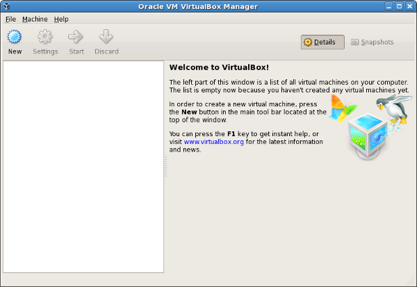
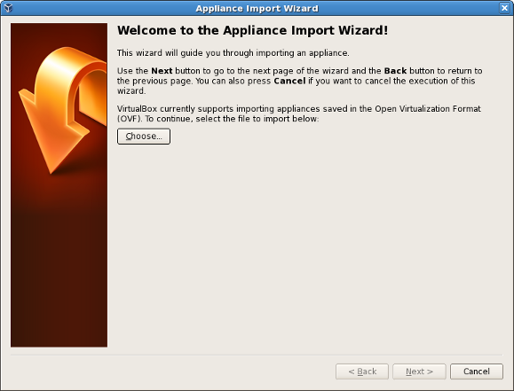
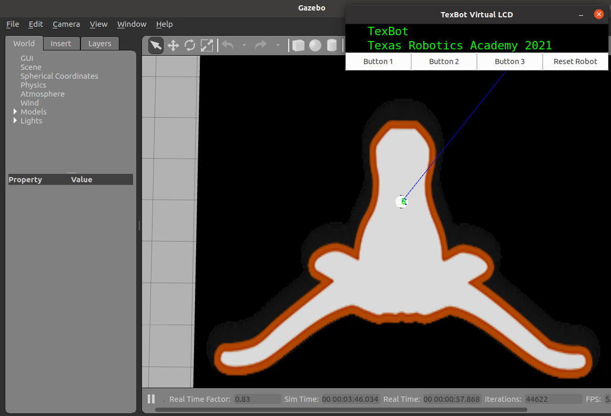

# XB100 Lab1
## Host PC and Virtual machine requirements
1. Host PC: 8+ cores, 8+GB Memory, 50+GB free harddisk drive 
2. Virutal PC will be allocated half of host's resources such as: 4+ cores, 4+GB memory, 25+GB hard disk

## Install Virtual Machine for XB100 classes

1. Download and Install Virtual Box:  
https://www.virtualbox.org/wiki/Downloads

2. Download preinstalled XB100 Virtual Machine images:  
https://www.icloud.com/iclouddrive/0a06crdVY3BjbtG3geujcn4ww#xbots.ova

3. Importing above downloaded Virtual Machine images into VirtualBox   
   <br><br>

   In the File menu, select Import Appliance. The Appliance Import wizard is displayed in a new window, as shown in
   <br><br>

   Click Choose, browse to the location containing the *.ovf or *.ova file of the virtual machine you just download to import, and click Open.

4. Start the Virtual Machine   
   * VM User name: xcamp  or chuanqi
   * Password: xcamp2022
   * root password: xcamp2022

* If for somereason, above image doesn't work for you, you need manual install ubuntu and ROS, here are the instruction: 
  1. [Manually install Ubuntu](https://github.com/chuanqichen/XB100/blob/main/lab1/manual_steps_instructions/install_ubuntu20.04_virtual_box.md)
  2. Try to run auto script [ros.sh](../lab4/ros.sh) or step by step [Manually install ROS](https://github.com/chuanqichen/XB100/blob/main/lab1/manual_steps_instructions/install_ros_step_by_step.md)

## How to launch and test your simulator to get ready for this class
open a terminal to run following two commands:
```
roslaunch texas_robotics_academy test_world.launch 
```
And you should have following simulator launched successfully. <br>
<br>
open another terminal to run following teleop_texbot and following onscreen instruction to control the robot:
```
rosrun texas_robotics_academy teleop_texbot
```
Close above simulator once you verify the teleop_texbot works. 

Then we need check if catkin development environment is healthy: 
```
xcamp@xbots:~$ cd catkin_ws/
xcamp@xbots:~/catkin_ws$ catkin build
```
There are some warnings, but as long as all 8 packages have been built successfully like below at the end, then everything is Okay. 
```
[build] Summary: All 8 packages succeeded!                                     
[build]   Ignored:   None.                                                     
[build]   Warnings:  3 packages succeeded with warnings.                       
[build]   Abandoned: None.                                                     
[build]   Failed:    None.                                                     
[build] Runtime: 45.3 seconds total.  
```

## Familiar with Ubuntu Linux 
* Introduction to Linux [linux_intro.md] (https://github.com/chuanqichen/XB100/blob/main/lab1/linux_intro.md) 

## Homework "Learn C++ Programming":
   *  https://codehs.com/go/05A14  (create your account if you have not had yet)
   * "Unit 1: C++ BASICS" is MUST and other units are nice to learn.  
   *  Our teaching staff can help you during office/lab hours.  
