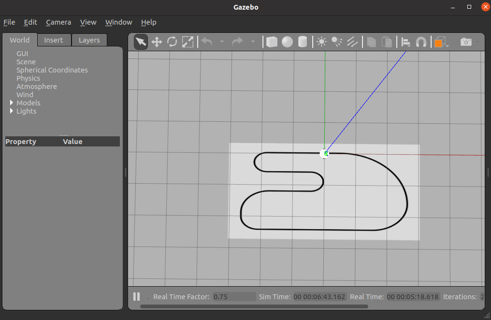

# Get latest instruction 
```
cd
cd XB100
git pull
```

# Follow the race track using PID controller 
Make the robot move forward and follow the line of the track.

[Detailed Project Description](https://github.com/chuanqichen/XB100/blob/main/lab11/robot_race.md)<br>



## launch simulator 
```
roslaunch texas_robotics_academy race.launch
```

## Code Assignment: robotcamp_exercises/8/src/ex_8.cpp
```
cd ~/catkin_ws
catkin build
rosrun 8_1 ex_8_1
```

## Tutorial 
* Mobile Robots:
  * https://www.youtube.com/watch?v=IRwyOPO6KR4
* ROS Tutorial:
  * https://wiki.ros.org/ROS/Tutorials
* Shakey the Robot: The First Robot to Embody Artificial Intelligence
  * https://www.youtube.com/watch?v=7bsEN8mwUB8
* Grey Walter's tortoises
  * https://www.youtube.com/watch?v=lLULRlmXkKo
