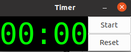

# Race!
For the final challenge, we're going to race our robots against each other for the prize of ultimate bragging rights!


In this challenge, we will be using the **race.launch** file, which includes a slightly different display from what you are used to.

## Timer



You will notice instead of our normal LCD display, you are greeted with a timer with a start and reset button.

For the purposes of the challenge, the start button will map to Button 1 and the reset button will map to Button 2. The reset button already has the same functionality as the "Reset Robot" button from before, and additionally it will reset the timer.

## Challenge 8: Final Challenge!

```
void startTimer()
```

The ```startTimer()``` function does exactly what it says. It starts the timer when you call it! You will need to use this function to complete the challenge.

Your challenge will be to:
- Program the buttons on the timer so that the start button will start **both** the timer and the robot's motion, and the reset button will stop the robot's motion.

- Get your robot around the track in the fastest time possible! *(Note: do NOT include functionality to change any parameters while the race is running.)*

When you are confident in your robot's abilities, request a counselor and we will watch your robot and then upload your best time to the leaderboard!

Don't worry if your simulation runs slower. The timer accounts for this and adjusts accordingly!

Challenge 8, 8

## Reference:
* https://github.com/Texas-Robotics-Academy/markdown.git
