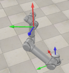
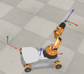

##  Configuration Space and Work Space
* Four Main Types of Robotic Arm Geometry by Engineering Technology Simulation Learning Videos Channel
** https://www.youtube.com/watch?v=R0eJXe6R8vY
* Configuration space and robot design: https://www.cs.unc.edu/~jeffi/c-space/robot.xhtml
* Work Envelop : https://www.youtube.com/watch?v=_canCYWZPsc

## Familiar with Ubuntu Linux 
* reference to: linux_intro.md => Homework 
  * https://github.com/chuanqichen/XB100/blob/main/lab2/linux_intro.md

## Install modern robotics python library 
* Open a Terminal
* sudo apt install python3-pip
* pip3 install modern_robotics

## Install vscode 
* Open a Terminal
* sudo snap install --classic code
* Get comfortable using vscode => Homework

## git command and download the lab2 
* sudo apt install git
* git clone https://github.com/chuanqichen/XB100.git
* cd XB100
* cd lab2
* unzip V-REP_scenes-Nov2019.zip

## Install CoppeliaSim robot simulator 
* cross-platform CoppeliaSim robot simulator (formerly known as V-REP)
* Go to [http://www.coppeliarobotics.com/](https://www.coppeliarobotics.com/downloads), click "choose a different platform", choose "Ubuntu 20.04" to download 
* Install CoppeliaSim edu software
   * cd 
   * cd Downloads 
   * Extract the compressed tar archive 
     * tar -xvf CoppeliaSim_Edu_V4_0_0_Ubuntu20_04.tar.xz
   * mv CoppeliaSim_Edu_V4_0_0_Ubuntu20_04 ../
   * cd ..
* Run the CoppeliaSim simulator 
   * Change directories into the CoppeliaSim source directory 
     * cd CoppeliaSim_Edu_V4_3_0_rev10_Ubuntu20_04
   * run the coppeliaSim.sh shell script:   ./coppeliaSim.sh

## Homework: Run Robot Simulation 
Once CoppeliaSim is open you will want to run one of the scenes below. To run any of them, you first run CoppeliaSim, then you click File->Open scene... and open one of the ttt files that are listed for each scene. Then click either the Play button from the top toolbar or click Simulation->Start simulation and a GUI should pop up. Clicking the Stop button or Simulation->Stop simulation will close the GUI and stop the simulation.

The "interactive" scenes allow you to visualize the robot as you change its configuration using sliders. The "CSV" scenes allow animations of a robot based on a trajectory stored in a comma-separated values file, where each line corresponds to a timestep and consists of comma-separated numbers specifying the robot's configuration at that timestep. There are no joint limits in the "CSV" scenes.

### Scene 1: Interactive UR5
  
* Scene1_UR5.ttt: the CoppeliaSim scene file.

This scene helps you visualize a UR5 robot from Universal Robots. The model of the UR5 was created by importing a URDF from the ROS-Industrial ur5_description package. The GUI in this scene features two tabs. One tab lets you drag sliders to modify the joint angles of each joint, and the other tab allows you to specify comma-separated angles for all 6 joints in an editable text box and ask for the SE(3) transformation from the base frame to the end-effector frame. The frames attached to the base and end-effector are persistently displayed (x-axis in red, y-axis in green, z-axis in blue). Note that all angles are specified in radians.

### Scene 2: CSV Animation UR5
* Scene2_UR5_csv.ttt: the CoppeliaSim scene file.
* Scene2_example.csv: an example input file.

This scene animates the motion of the UR5 robot based on a csv file representing the trajectory of the robot. Each row of the csv file represents a timestep and each column of the csv file is the joint angle through time for one of the joints (first column is joint 1, last column is joint 6).

### Scene 3: Interactive youBot
  
* Scene3_youBot.ttt: the CoppeliaSim scene file.

This scene helps you visualize a youBot mobile manipulator from KUKA. The KUKA youBot consists of a mecanum-wheel omnidirectional base and a 5R robot arm. Move the mobile base of the robot and the joints of the robot using sliders, and inspect the SE(3) representation of the resulting end-effector coordinate frame. All angles are represented in radians, and linear distances are represented in meters. The following frames are illustrated: the world frame {s}, a frame fixed to the center of the mobile chassis {b}, a frame fixed at the base of the robot arm {0}, and a frame fixed to the end-effector {e}.

