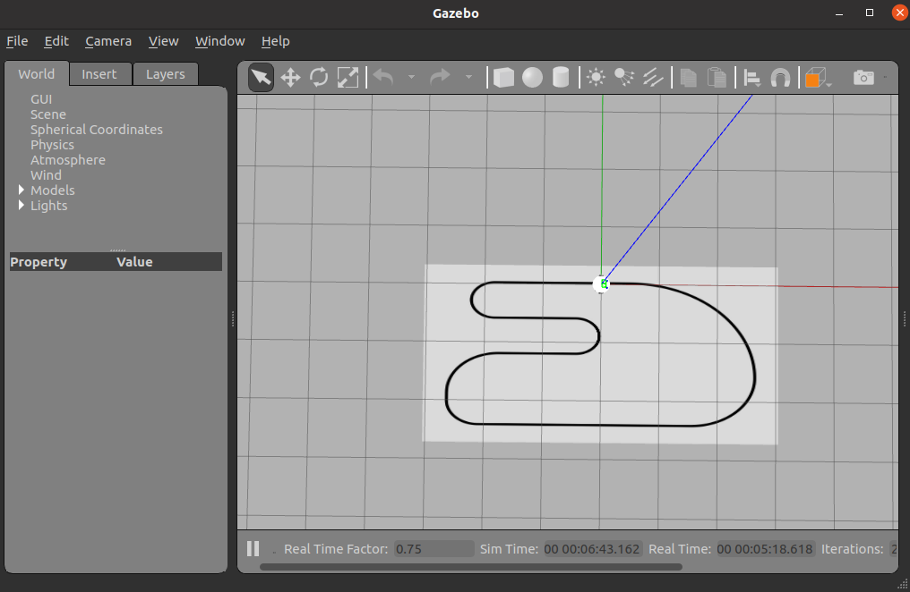

# Line Following using PID Controller
In this tutorial, you're going to make the robot follow a line on the ground.


You'll be using the racetrack.launch launch file for these exercises.

At the end, you will be invited to race the other groups.

*Awesome.*

### Exercise 7.1.1 - Automatically Finding the Line

In the previous tutorial, you found the line by setting a threshold. You can actually automatically find the line as well, by choosing the line sensor with the highest value.

We think that you're ready for a slightly harder tutorial. So I'm just going to tell you how this is done.

- Check the first sensor channel.
- Store its value in a variable.
- Use a **loop** to check each of the eight channels.
- **If** a channel has a higher value than the one stored, store that value.
- Always store the channel corresponding to the highest value as well.
- Put this into a **function**.
- Test that your detector works by using the `printAsterisks` function from the previous tutorial.


### Exercise 7.1.2 - Describing Where the Line Is

If the line is in the channel all the way to the left, the method above should give you 0.

If the line is in the channel all the way to the right, the method above should give you 7.

Right in the middle would be 3.5.

- Write a function that scales the output of the automatic line finding to range from -1 to 1, using the facts listed here.
- Print your asterisks on the first line of the LCD, and the value returned by this function on the second line.


### Exercise 7.1.3 - A Proportional Controller for Line Following

You may be familiar with the formula for the slope of a line. That would be `y = mx + c`. The term m is slope. (You may have seen this as `y = mx + b`, it's the same thing.)

We haven't *actually* computed the slope of a line. What we've computed is called a **potential**. It indicates where the line is on the robot. However, we can combine this concept with the formula for the slope of a line to create a simple **linear controller**. This controller is **linear** because the formula that it uses is a linear function. This controller is more commonly known as a **proportional** controller.

As realized on our robot, this will look something like this.

- The potential that you computed in Exercise 7.1.2 is going to be used to steer the robot.
- The robot should default to going forward at a constant speed. You do this with a **constant term** or **constant weight**. In `y = mx + c`, that term is `c`.
  - Your constant term in your program will look something like `one.move(constant, constant)`.
- The potential that you computed in Exercise 7.1.2 can be thought of as the term `m` in `y = mx + c`. When you turn the robot, you want to spin one wheel more than the other. To accomplish this, you should compute a number, using `y = mx + c` where you add mx to one side, and subtract `mx` from the other side. You can think of the formula now as `speed = b + mx, speed = b - mx`.
  - `c` is your constant weight, or **constant gain** (`K_c`).
  - `x` is your **proportional weight**, or, as it is better known **proportional gain** (`K_p`).
    - This weight will have to be fine-tuned by you!
- Write a program that creates a proportional controller, using the facts that have been written here.
- Write an interface using the push buttons on the robot to allow you to adjust the constant and linear weights up and down.
- Test your robot in the racetrack world and try it on our race course using the proportional controller.


### Exercise 7.1.4 - A Proportional Derivative (PD) Controller for Line Following

You probably noticed that your robot jerked around when using the proportional controller. This is known as "bang-bang control," and we try to prevent it from happening.

We can improve on our control by adding the **derivative term**. Derivative comes from the term in calculus, meaning rate of change.

If you've taken calculus, you've heard of the **finite differences method.** What it basically says is that you can approximate instantaneous slope of a tangent line (its rate of change, or derivative) by subtracting one point from another point along a cuve. This works well if the two points are close together.

Think of your robot as sampling two points on a curve, and the angle that you want the robot to steer at as the tangent line on the curve.

In this tutorial, you're going to make the robot follow a line on the ground.

You'll be using the racetrack.launch launch file for these exercises.

At the end, you will be invited to race the other groups.

*Awesome.*

### Exercise 7.1.1 - Automatically Finding the Line

In the previous tutorial, you found the line by setting a threshold. You can actually automatically find the line as well, by choosing the line sensor with the highest value.

We think that you're ready for a slightly harder tutorial. So I'm just going to tell you how this is done.

- Check the first sensor channel.
- Store its value in a variable.
- Use a **loop** to check each of the eight channels.
- **If** a channel has a higher value than the one stored, store that value.
- Always store the channel corresponding to the highest value as well.
- Put this into a **function**.
- Test that your detector works by using the `printAsterisks` function from the previous tutorial.


### Exercise 7.1.2 - Describing Where the Line Is

If the line is in the channel all the way to the left, the method above should give you 0.

If the line is in the channel all the way to the right, the method above should give you 7.

Right in the middle would be 3.5.

- Write a function that scales the output of the automatic line finding to range from -1 to 1, using the facts listed here.
- Print your asterisks on the first line of the LCD, and the value returned by this function on the second line.


### Exercise 7.1.3 - A Proportional Controller for Line Following

You may be familiar with the formula for the slope of a line. That would be `y = mx + c`. The term m is slope. (You may have seen this as `y = mx + b`, it's the same thing.)

We haven't *actually* computed the slope of a line. What we've computed is called a **potential**. It indicates where the line is on the robot. However, we can combine this concept with the formula for the slope of a line to create a simple **linear controller**. This controller is **linear** because the formula that it uses is a linear function. This controller is more commonly known as a **proportional** controller.

As realized on our robot, this will look something like this.

- The potential that you computed in Exercise 7.1.2 is going to be used to steer the robot.
- The robot should default to going forward at a constant speed. You do this with a **constant term** or **constant weight**. In `y = mx + c`, that term is `c`.
  - Your constant term in your program will look something like `one.move(constant, constant)`.
- The potential that you computed in Exercise 7.1.2 can be thought of as the term `m` in `y = mx + c`. When you turn the robot, you want to spin one wheel more than the other. To accomplish this, you should compute a number, using `y = mx + c` where you add mx to one side, and subtract `mx` from the other side. You can think of the formula now as `speed = b + mx, speed = b - mx`.
  - `c` is your constant weight, or **constant gain** (`K_c`).
  - `x` is your **proportional weight**, or, as it is better known **proportional gain** (`K_p`).
    - This weight will have to be fine-tuned by you!
- Write a program that creates a proportional controller, using the facts that have been written here.
- Write an interface using the push buttons on the robot to allow you to adjust the constant and linear weights up and down.
- Test your robot in the racetrack world and try it on our race course using the proportional controller.


### Exercise 7.1.4 - A Proportional Derivative (PD) Controller for Line Following

You probably noticed that your robot jerked around when using the proportional controller. This is known as "bang-bang control," and we try to prevent it from happening.

We can improve on our control by adding the **derivative term**. Derivative comes from the term in calculus, meaning rate of change.

If you've taken calculus, you've heard of the **finite differences method.** What it basically says is that you can approximate instantaneous slope of a tangent line (its rate of change, or derivative) by subtracting one point from another point along a cuve. This works well if the two points are close together.

Think of your robot as sampling two points on a curve, and the angle that you want the robot to steer at as the tangent line on the curve.

If this doesn't make sense to you, get a counselor to help you. If it doesn't make sense to them, get them to get Justin, and make them listen to the explanation too.

What this all means is that you can take the potential calculated in Exercise 7.1.2 at your current time step, subtract the potential computed at the *previous* time step (a time step being one execution of your `loop` function) and arrive at the derivative that you want.

You now have 3 terms for your controller:
- **Constant gain** (`K_c`).
- **Proportional gain** (`K_p`).
- **Derivative gain** (`K_d`).

The formulas for your controller now look like 

```
K_c + (K_p * p + K_d * d)
K_c - (K_p * p + K_d * d)
```

- Implement this on your robot.
- Add `K_d` to your user interface.
- Try your robot on the race course using the PD controller.


### Exercise 7.1.5 - A Proportional Integral Derivative (PID) Controller for Line Following (Optional)

Probably the best known controller is the PID controller, where I stands for **integral**, and, yes, it means the same thing as in calculus.

In practice, you can compute your numerical integral by adding up your potentials over time to arrive at area under the curve for your potential.

- **Constant gain** (`K_c`).
- **Proportional gain** (`K_p`).
- **Derivative gain** (`K_d`).
- **Integral gain** (`K_i`).

- Implement this on your robot.
- Add `K_i` to your interface.
- Test your robot on the race course using the PID controller.


Take the potential calculated in Exercise 7.1.2 at your current time step, subtract the potential computed at the *previous* time step (a time step being one execution of your `loop` function) and arrive at the derivative that you want.

You now have 3 terms for your controller:
- **Constant gain** (`K_c`).
- **Proportional gain** (`K_p`).
- **Derivative gain** (`K_d`).

The formulas for your controller now look like 

```
K_c + (K_p * p + K_d * d)
K_c - (K_p * p + K_d * d)
```

- Implement this on your robot.
- Add `K_d` to your user interface.
- Try your robot on the race course using the PD controller.


### Exercise 7.1.5 - A Proportional Integral Derivative (PID) Controller for Line Following (Optional)

Probably the best known controller is the PID controller, where I stands for **integral**, and, yes, it means the same thing as in calculus.

In practice, you can compute your numerical integral by adding up your potentials over time to arrive at area under the curve for your potential.

- **Constant gain** (`K_c`).
- **Proportional gain** (`K_p`).
- **Derivative gain** (`K_d`).
- **Integral gain** (`K_i`).

- Implement this on your robot.
- Add `K_i` to your interface.
- Test your robot on the race course using the PID controller.


## Reference:
* https://github.com/Texas-Robotics-Academy/markdown.git
